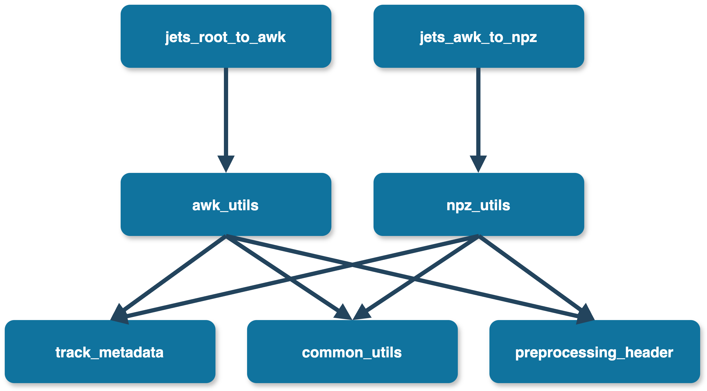

# JetPointNet

This repository contains the code used to develop particle-flow models based on pointcloud data for jets data.

## Installation
The current version has been tested with the following environment settings:

```
python 3.10.14
awkward 2.6.4
uproot 5.3.7
numpy 1.26.4
pandas 2.2.2
tensorflow 2.16.1
keras 3.3.3
```

For a minimal installation you can first create a conda environment with `conda create --name pointcloud python=3.10`. 
Then make use of the `requirements.txt` file and run:

```
conda activate pointcloud
pip install -r requirements.txt # --no-cache-dir

```

Please note that `--no-cache-dir` option is suggested.

## Usage

A basic usage flow would be the following:
 - update configurations and paths inside `python_scripts/data_processing/preprocessing_header.py`
 - run `python_scripts/data_processing/jets_root_to_awk.py` to convert *root* data into *awkward array* format. 
  This reads data from `FILE_LOC` and `GEO_LOC` and saves results into the `AWK_SAVE_LOC` (all defined in `preprocessing_header.py`)
 - run `python_scripts/data_processing/jets_awk_to_npz.py` to convert *awkward array* data into *npz* format. This reads data from `AWK_SAVE_LOC`
 - once you have preprocessed data, then you can start playing with training scripts at `python_scripts/jets_training/`. 
  In particular, the script `jets_train.py` has been mainly tested so far


## Notes

This branch assumes the repository is located at HOME_PATH / workspace/jetpointnet.
Also, raw data files are read from eos (namely */eos/home-m/mswiatlo/forLuca/*  and  */eos/home-m/mswiatlo/images/truthPerCell*), while derived files are stored inside the repo at `pnet_data/` folder and organised in subfolders.

### Preprocessing dependency tree

