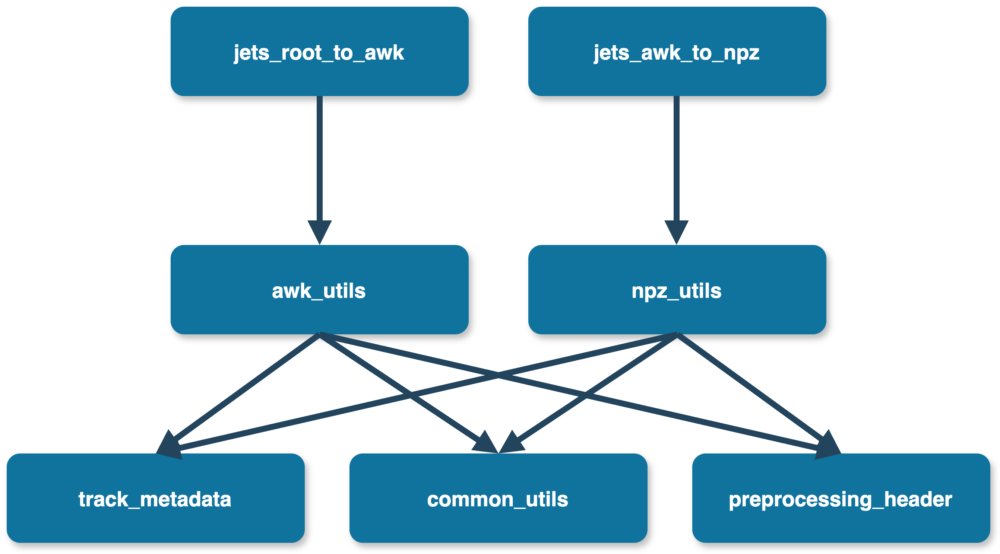

# JetPointNet

This repository contains the code used to develop particle-flow models based on pointcloud data for jets data.

## Minimal Installation
For a minimal installation you can first create a conda environment with `conda create --name pointcloud python=3.10`.
Then make use of the `requirements.txt` file and run:

```shell
git clone ssh://git@gitlab.cern.ch:7999/atlas-jetetmiss/pflow/commontools/jetpointnet.git
conda activate pointcloud
pip install -r requirements.txt # --no-cache-dir

```

Please note that `--no-cache-dir` option is suggested.

## Working Installation
Ensure that you have a python version (3.10 or newer installed on your system).
Then you can clone the repository and run the setup script:

This script will set up the development environment using poetry and install all the necessary dependencies.
Additionally, it will configure pre-commit hooks to ensure consistent style and run test cases.

```shell
git clone ssh://git@gitlab.cern.ch:7999/atlas-jetetmiss/pflow/commontools/jetpointnet.git
make setup-env
```


## Usage

Data Preprocessing:

**Note:** preprocessing with the ttbar set is possible, however with larger sets you should attempt to use already processed npz files to avoid a lengthy re-processing. Additionally for other sets you should use a grid job for the processing (see last set of instructions). The current data set is available as npz file on CERNBox, if you are using them you can skip these steps.
 - update configurations and paths inside `python_scripts/data_processing/preprocessing_header.py`
 - run `python_scripts/data_processing/jets_root_to_awk.py` to convert *root* data into *awkward array* format.
  This reads data from `FILE_LOC` or `FILES_DIR` and `GEO_LOC` and saves results into the `AWK_SAVE_LOC` (all defined in `preprocessing_header.py`)
 - run `python_scripts/data_processing/jets_awk_to_npz.py` to convert *awkward array* data into *npz* format. This reads data from `AWK_SAVE_LOC`

Model Training:
 - once you have preprocessed data, then you can start playing with training scripts at `python_scripts/jets_training/`.
  In particular, the script `jets_train.py` is used for running individual models and `jets_sweep.py` is used to perform sweeps.

## Notes

This branch assumes the repository is located at HOME_PATH / workspace/jetpointnet.
Also, raw data files are read from eos (namely */eos/home-m/mswiatlo/forLuca/*  and  */eos/home-m/mswiatlo/images/truthPerCell*), while derived files are stored inside the repo at `pnet_data/` folder and organised in subfolders.

### Preprocessing dependency tree



## Known Issues

- The early stopping of the train loop can cause the job to crash when enabled
